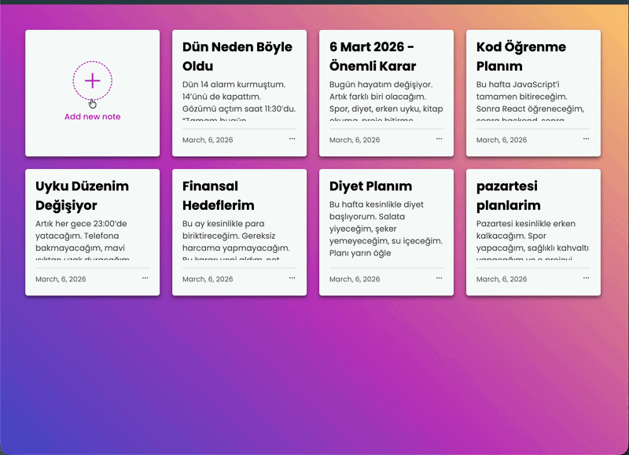
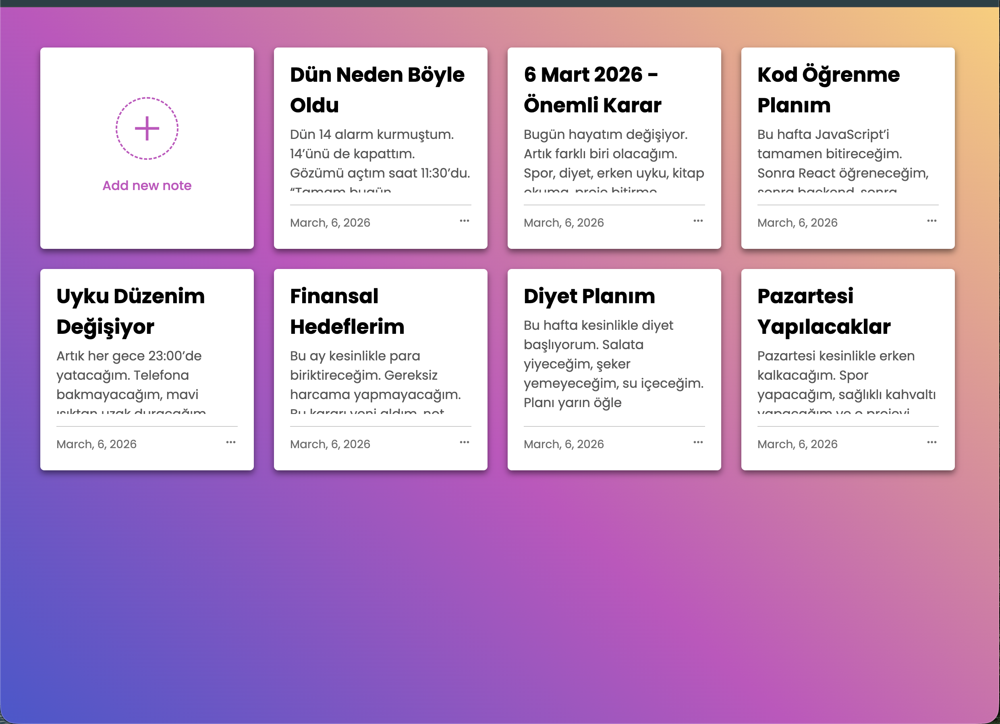

# 📝 Note-App

> Basit, şık ve kullanışlı bir not alma uygulaması. Notlarını ekle, düzenle, sil — hepsi anında!

-----

## 🎬 Demo



-----

## 📸 Ekran Görüntüsü



-----

## 🚀 Özellikler

- ✅ Yeni not ekleme (başlık + açıklama + tarih)
- ✏️ Mevcut notları düzenleme
- 🗑️ Not silme
- 💾 Veriler `localStorage` ile tarayıcıda saklanır — sayfa yenilense bile notlar kaybolmaz
- 📅 Otomatik tarih damgası
- 🎨 Sade ve modern arayüz tasarımı
- ⚡ Saf JavaScript — framework yok, bağımlılık yok

-----

## 🛠️ Kullanılan Teknolojiler

|Teknoloji                                                                                               |Açıklama            |
|--------------------------------------------------------------------------------------------------------|--------------------|
|               |Sayfa yapısı        |
|                  |Stil ve animasyonlar|
||Uygulama mantığı    |

-----

## 📂 Proje Yapısı

```
Note-App/
├── index.html       # Ana HTML dosyası
├── main.js          # Uygulama mantığı (CRUD işlemleri)
├── style.css        # Stil dosyası
├── screen/
│   ├── demovideo.gif
│   └── screen1.png
└── README.md
```

-----

## 💡 Öğrenilen Beceriler & Kazanımlar

Bu projeyi geliştirirken aşağıdaki konularda önemli deneyim kazanıldı:

- 🧠 **DOM Manipülasyonu** — `querySelector`, `innerHTML`, `createElement` ile dinamik içerik yönetimi
- 🔄 **CRUD İşlemleri** — Veri ekleme, okuma, güncelleme ve silme
- 💾 **localStorage API** — Tarayıcı tabanlı veri kalıcılığı
- 📅 **Date API** — JavaScript ile tarih ve zaman işlemleri
- 🎯 **Event Handling** — Kullanıcı etkileşimlerini yönetme
- 🧩 **Template Literals** — Dinamik HTML üretimi
- 🔍 **Array Methods** — `findIndex`, `forEach`, `filter` gibi fonksiyonların kullanımı
- 🎨 **CSS ile UI Tasarımı** — Popup, kart ve menü bileşenleri


-----

## 🙏 Teşekkür

Bu projeyi geliştirmem sürecinde ilham ve destek aldığım **[https://github.com/isveckrali]** hocama ve **[https://github.com/Udemig]** platformuna çok teşekkür ederim. Öğrettiğiniz her şey için minnettarım! 🫶

-----

## 📬 İletişim

Her türlü geri bildirim ve iş birliği için ulaşabilirsin:

[](https://lnkd.in/ddGnrJqc)
[](http://linkedin.com/in/numan-balik-sverige)
[] (numanbalik72@gmail.com)

-----

<p align="center">
  ⭐ Beğendiysen yıldız vermeyi unutma!
</p>
